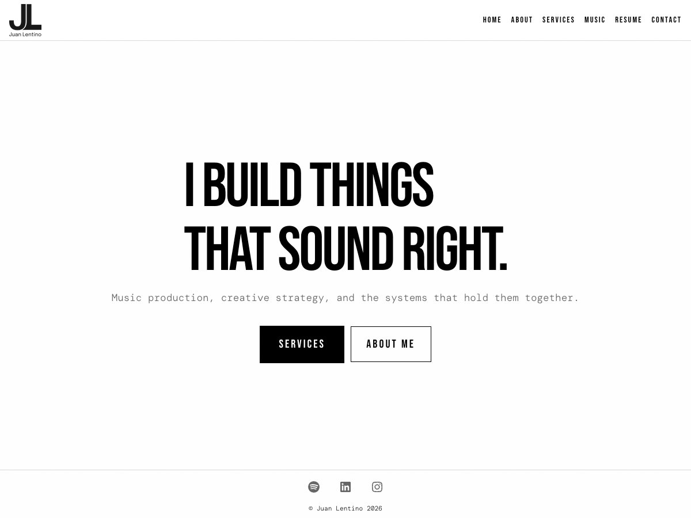

# Signal & Noise

A white-first, brutalist **WordPress Full Site Editing block theme** built for [juanlentino.com](https://juanlentino.com) — inspired by [nin.com](https://nin.com). Black text on white, generous whitespace, blood-red accents, and a Bebas Neue + DM Mono pairing. Buildless by design: vanilla CSS and JS, self-hosted fonts, zero npm/webpack.

## Design DNA

- **Palette** — `void` #ffffff · `asphalt` #f5f5f5 · `concrete` #d9d9d9 · `rust` #666 · `bone` #000 · `blood` #e00404 · `signal` #ff4c47 (all driven by `theme.json`)
- **Type** — Bebas Neue (display) + DM Mono (editorial), self-hosted woff2, no Google Fonts
- **Aesthetic** — high-contrast industrial minimalism: film-grain overlay, grayscale image filters, no rounded corners, no gradients
- **Long-form** — frontmatter spec card, drop caps, footnotes, sidenotes, justified text with hyphenation and hanging punctuation

## Stack

- WordPress 7.0+ FSE block theme · PHP 8.0+
- Vanilla CSS + JS — no build step, no framework, no jQuery
- Inlined critical CSS + deferred stylesheets; View Transitions for soft navigation
- Hosted on Cloudways, edge-cached via Cloudflare

## Pages & templates

Block templates for the homepage, long-form **notes**, and the standing pages — **About**, **Services**, **Music** (role-filtered discography grid + featured player, Muso.AI verified credits), **Resume**, **Contact**, **Colophon**, and the **Provenance** pillar. Plus four server-rendered virtual routes with no editor entry: **`/notes`** (notes dossier), **`/index`** (whole-site index), **`/uses`** (gear list), and **`/humans.txt`**. All design tokens are editable in the Site Editor under **Styles**.

## Front-end

- **Command palette** (`⌘`/`Ctrl-K` or `/`) — accessible, notes-scoped search and jump-to
- **Keyboard nav** — `j`/`k` previous/next note, `?` cheat-sheet (progressive enhancement; links work without JS)
- **Reading aids** — article TOC with a sticky progress bar, shared-tag related notes, a frontmatter spec card, and reading time
- **Feeds** — JSON Feed 1.1, WebSub (PubSubHubbub) advertisement, and Media-RSS enrichment
- **IndieWeb** — `rel=me` identity links, `humans.txt`, and a live colophon build line (`[sn_build]`: theme + plugin version, git SHA, deploy time)
- **Analytics** — a cookieless first-party beacon (Cloudflare Worker endpoint; respects DNT/GPC)
- **WordPress 7.0 Abilities API** — the theme registers read + generative-AI capabilities for agents

Every plugin-backed feature is guarded: the theme runs standalone and degrades gracefully when the companion plugin is absent.

## Companion plugin

Operational tooling — SEO, login hardening, admin surfaces, analytics, and AI-assisted health checks — lives in the companion plugin, [**Signal & Noise Tools**](https://github.com/juanlentino/signal-and-noise-tools), to keep this repo focused on presentation.

## Install

Distributed via GitHub releases (not the WordPress.org directory). Install/update through **wp-admin → Dashboard → Updates → Update theme**, powered by the theme's self-updater (`inc/wp-update-integration.php`). The companion plugin is recommended for the full feature set, but the theme runs standalone.

## License

[GNU General Public License v2 or later](LICENSE).

---

Built for [juanlentino.com](https://juanlentino.com). Full release history in [CHANGELOG.md](CHANGELOG.md).
