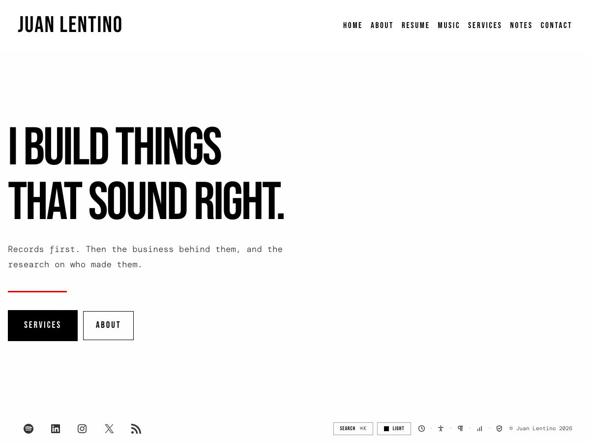

# Signal & Noise

A white-first, clinical-industrial **WordPress Full Site Editing block theme** with brutalist typography built for [juanlentino.com](https://juanlentino.com), inspired by [nin.com](https://nin.com). Black text on white, generous whitespace, blood-red accents, and a Bebas Neue + DM Mono pairing, with a full dark inversion since v12.0.0. Buildless by design: vanilla CSS and JS, self-hosted fonts, zero npm/webpack.

## Design DNA

- **Palette** — `void` #ffffff · `asphalt` #f5f5f5 · `concrete` #d9d9d9 · `rust` #666 · `bone` #000 · `blood` #e00404 · `signal` #ff4c47 (all driven by `theme.json`)
- **Three palettes, not one** — the site can present `root` (theme.json), the shipped `high-contrast` variation, and `dark`. `get-design-tokens` reports all three plus which one is served. Any color reasoning has to hold in all of them: `blood` #e00404 clears AA on white at 5.01:1 and fails on the dark ground at 3.95:1, which is why dark re-points it to #ff4c47 (6.01:1)
- **Dark** — a token layer, not a second stylesheet. `:root[data-theme="dark"]` and a `prefers-color-scheme` block redefine the same `--wp--preset--color--*` properties every component already consumes, so nothing can be half-converted. Ground #0a0a0a, `bone` inverts to white, the film grain flips `multiply` to `screen` so the texture survives, and the header mark is an inline SVG inked with `bone`, so it flips with the token. It writes nothing to the database
- **Semantic tokens beyond the palette** — `--sn-panel*` for surfaces that deliberately contrast with the page (the command palette, the keyboard modal, the skip link: a *raised dark* surface in dark, never a white card), and `--sn-embed-backdrop` for third-party chrome, identical in both schemes because it matches somebody else's card
- **Type** — Bebas Neue (headings, buttons, navigation) + DM Mono (body text, captions), self-hosted woff2, no Google Fonts
- **Aesthetic** — high-contrast industrial minimalism with brutalist typography: film-grain overlay, grayscale image filters, no rounded corners (the four non-zero radii are three true circles and Spotify's own embed). Raised surfaces use a hard offset shadow with no blur, the command palette's and keyboard modal's `8px 8px 0` in the `--sn-panel-shadow` token and the note cards' `4px 4px 0` in `concrete`; the only blurred shadows in the theme are two deliberate `blood` glows, on button hover and the discography play badge. No gradient is decorative: the ones left are the scanline overlay, the link underline and an embed mask, and the grain is an SVG noise image. Dark is an inversion rather than a softening: no elevation ramp, no gray "surfaces", hairlines stay hairlines
- **Long-form** — frontmatter spec card, drop caps, footnotes, sidenotes, justified text with hyphenation and hanging punctuation

## Stack

- WordPress 7.0+ FSE block theme, **tested up to and running on 7.1** (`style.css` `Tested up to`; juanlentino.com runs 7.1 in production) · PHP 8.3+
- Vanilla CSS + JS — no build step, no framework, no jQuery
- Inlined critical CSS + one combined, minified stylesheet the theme builds itself (`inc/asset-combine.php`, fail-open to the per-file enqueues); View Transitions for soft navigation
- Hosted on Cloudways, edge-cached via Cloudflare

## Pages & templates

Block templates for the homepage, long-form **notes**, and the standing pages — **About**, **Services**, **Music** (role-filtered discography grid + featured player, Muso.AI verified credits), **Resume**, **Contact**, **Now**, **Uses**, **Accessibility**, **Workflow**, **Personal** (`/contact/personal`), and the **Provenance** pillar. **Now** and **Uses** are spec sheets: a band per group, the heading on the left and the items two across, stacking at 900px (the same pattern the plugin paints for the colophon and the Maturity pages). **Colophon** is CMS-owned (rendered via a Site Editor `wp_template` override of the plugin's `[sn_colophon]` shortcode, since plugin v10.13.0) rather than a theme template file. **`/notes`** is a Page whose layout is rendered in PHP (`inc/page-notes-template.php`); only its pillar rail is editable. Plus server-rendered virtual routes with no editor entry: **`/index`** (whole-site index), **`/humans.txt`**, and the machine-readable set — **`/llms.txt`** + **`/llms-full.txt`**, **`/opensearch.xml`**, **`/.well-known/agents.json`**, **`/.well-known/security.txt`**, **`/.well-known/gpc.json`**, and a **`.json`** content twin of every Note. `/llms.txt` (`inc/llms-txt.php`) opens with a summary whose note and paper counts are derived from the corpus, never written by hand; its Key pages list is curated by hand, Start Here and Objections included, and is never filled from a page's children. All design tokens are editable in the Site Editor under **Styles**.

## Front-end

- **Command palette** (`⌘`/`Ctrl-K` or `/`) — accessible, notes-scoped search and jump-to
- **Keyboard nav** — `j`/`k` previous/next note, `?` cheat-sheet (progressive enhancement; links work without JS)
- **Theme toggle** — follows the OS by default and persists an explicit choice. It renders in whichever bar is *persistent* at that width: the footer utility strip at ≥782px, the header at ≤781px, keyed to the same 781px boundary that makes the footer static on a phone. Ships `hidden` and is revealed only by the script that makes it work, because a toggle that cannot persist a choice is worse than none
- **Touch-correct hover** — every `:hover` rule sits behind `@media (hover: hover)`, with `:focus-visible` deliberately outside it. On iOS a tap applies `:hover` and keeps it until the next tap elsewhere, so an unguarded hover state stops reading as feedback and becomes the control's apparent resting style. A `(hover: none)` block also neutralizes the unguarded hovers WordPress generates from `theme.json` into `global-styles-inline-css`, which the theme cannot reach any other way
- **Reading aids** — article TOC with a sticky progress bar, shared-tag related notes, a frontmatter spec card, and reading time
- **Provenance** — each Note carries a byline verification chip and an expandable record panel showing it's Ed25519-signed and Bitcoin-anchored, with links to the on-chain block and the public ledger. The plugin owns the markup (`sn_prov_render_chip` / `sn_prov_render_panel`); the theme places them in the byline + closing parts (see `inc/provenance-surface.php`)
- **Fifteen dynamic blocks** (`blocks/`, each `render.php`). Three are authoring blocks with editor controls, `signal-noise/pillar-essays`, `signal-noise/sidenote` and `signal-noise/pull-quote`: their text lives in block-delimiter attributes rather than serialized HTML, and they are available on Pages as well as Notes. The other twelve are template blocks auto-registered from `block.json` (`inc/blocks-php-only.php`)
- **Pillar essays** — the curated cornerstone essays render through the owner-placeable `signal-noise/pillar-essays` block, numbered with the owner's editorial designations (№ 1.01); a flagged essay's own page carries that designation as an eyebrow (`inc/pillar-title-eyebrow.php`). Two attributes shape it in place: `compact` drops the deks and CTAs down to a linked row list, and `headingLevel` (2–4) lets it sit under an existing outline without breaking heading order. The compact form is what renders as the pillar rail in the `/notes` hero
- **Feeds** — JSON Feed 1.1, WebSub (PubSubHubbub) advertisement, and Media-RSS enrichment; feed items for verifiable Notes republish the provenance uid (a `_signal_noise` JSON Feed extension and an RSS `<sn:noteUid>` element), so a subscriber can reach the verification docket without a second fetch
- **IndieWeb** — `rel=me` identity links and `humans.txt`, whose stack facts are the colophon's own (read from the plugin's `sn_colophon_plain_facts()`). The colophon ends with the theme and plugin versions, each linked to its changelog. The `[sn_build]` shortcode (theme + plugin version, git SHA, deploy time) stays registered but is not on the page
- **Accessibility, measured live**: links in dimmed text (gray paragraphs, sidenotes, the resume rail) are underlined at rest, since their color alone falls under 3:1 against the text around them (WCAG 1.4.1), dim text uses the `rust` token rather than opacity, and under `prefers-reduced-motion: reduce` a global reset in `base.css` stops every animation and transition. `.github/workflows/contrast.yml` checks this on the rendered site, not the tokens: on every push to main, daily at 06:41 UTC and on demand, `tools/contrast-ci.mjs` reads the sitemap's pages, its two newest notes and one tag archive, loads `tools/contrast-computed.js` into each with Playwright, and fails on text below AA or on a link in running text that is neither underlined nor 3:1 against its surrounding text (WCAG 1.4.1), skipping what it cannot measure (listed in `docs/ACCESSIBILITY.md`). A run that reaches measurement ends with a `contrast-summary` notice (pages, pairs, links, failures), which the plugin's Health report reads; a run that cannot measure is a green job with a warning
- **Analytics** — a cookieless first-party beacon (Cloudflare Worker endpoint; respects DNT/GPC)
- **WordPress 7.0 Abilities API** — the theme registers read + generative-AI capabilities for agents
- **Editorial conventions as data** — `inc/editorial-conventions.php` registers every house form (patterns, block styles, className conventions, dynamic blocks, markup idioms) with an exemplar, placement and reachability; `get-editorial-conventions` hands it to agents before they compose, and a parity test keeps it true against the CSS and the pattern files

Every plugin-backed feature is guarded: the theme runs standalone and degrades gracefully when the companion plugin is absent.

## Companion plugin

Operational tooling — SEO, login hardening, admin surfaces, analytics, and AI-assisted health checks — lives in the companion plugin, [**Signal & Noise Tools**](https://github.com/juanlentino/signal-and-noise-tools), to keep this repo focused on presentation.

## Install

Distributed via GitHub releases (not the WordPress.org directory). Install/update through **wp-admin → Dashboard → Updates → Update theme**, powered by the theme's self-updater (`inc/wp-update-integration.php`). The companion plugin is recommended for the full feature set, but the theme runs standalone.

## License

[GNU General Public License v2 or later](LICENSE).

---

Built for [juanlentino.com](https://juanlentino.com). Full release history in [CHANGELOG.md](CHANGELOG.md).
